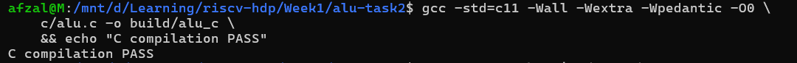
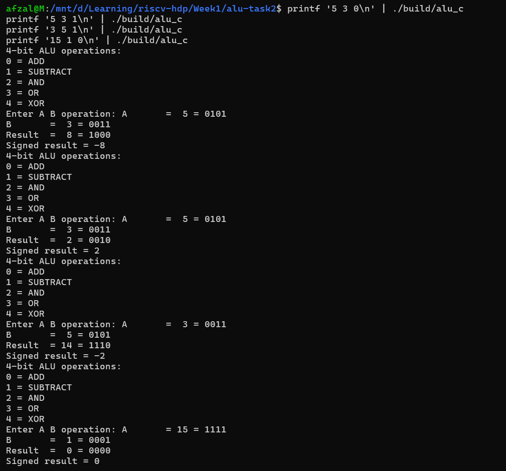
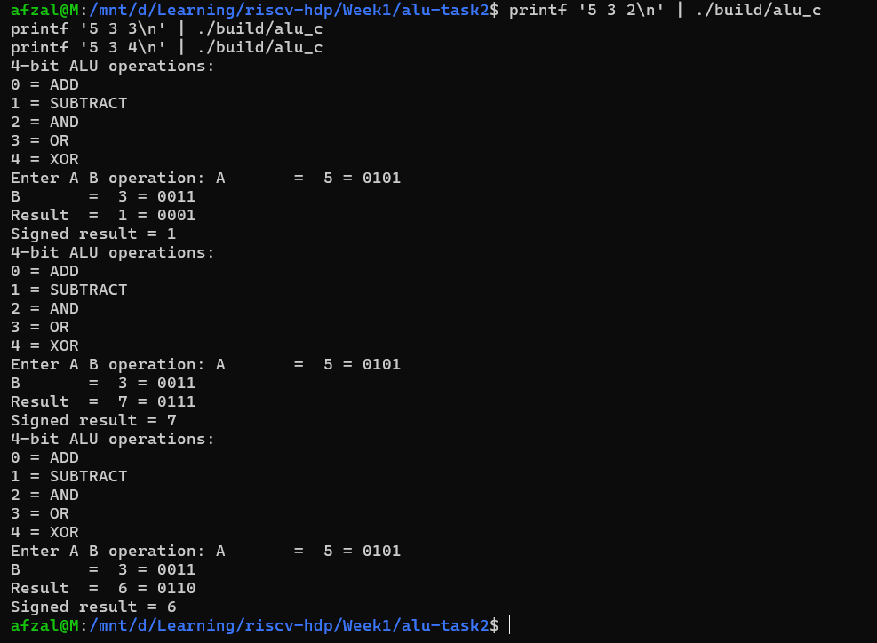
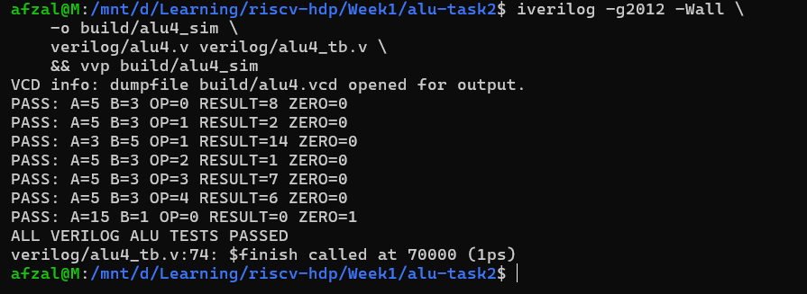
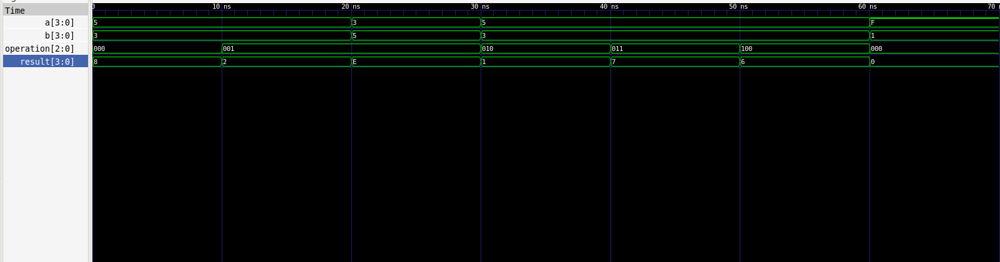

# Task 2: Binary Arithmetic and 4-bit ALU

## Objective

This task covers:

1. Binary arithmetic using sign-and-magnitude, one's complement, and two's complement.
2. Designing and testing a 4-bit ALU in C.
3. Designing and verifying the same ALU in Verilog using Icarus Verilog and GTKWave.

## Directory Structure

```text
alu-task2/
├── README.md
├── calculations.md
├── c/
│   └── alu.c
├── verilog/
│   ├── alu4.v
│   └── alu4_tb.v
├── build/
└── screenshots/
    ├── 01_c_compile.png
    ├── 02_c_add_sub_tests.png
    ├── 03_c_logic_tests.png
    ├── 04_iverilog_compile_and_results.png
    └── 05_gtkwave_all_operations.png
```

## Part 1: Binary Arithmetic

Eight-bit values were used because the given decimal values cannot all be represented using four bits.

The complete calculations are available in [calculations.md](calculations.md).

| Expression | Decimal result | Sign-and-magnitude | One's complement | Two's complement |
|---|---:|---|---|---|
| `10 - 19` | `-9` | `10001001` | `11110110` | `11110111` |
| `20 + 30` | `+50` | `00110010` | `00110010` | `00110010` |
| `36 - 12` | `+24` | `00011000` | `00011000` | `00011000` |

## Part 2: 4-bit ALU in C

The C implementation accepts two four-bit operands and an operation code. The result is masked with `0xF`, ensuring that only the lowest four bits are retained.

### Operation Encoding

| Decimal | Binary | Operation |
|---:|---|---|
| `0` | `000` | Addition |
| `1` | `001` | Subtraction |
| `2` | `010` | Bitwise AND |
| `3` | `011` | Bitwise OR |
| `4` | `100` | Bitwise XOR |

### Compilation

```bash
gcc -std=c11 -Wall -Wextra -Wpedantic -O0 \
    c/alu.c -o build/alu_c
```



### Addition and Subtraction Tests

| A | B | Operation | Four-bit result | Signed interpretation |
|---:|---:|---|---|---:|
| 5 | 3 | ADD | `1000` | -8 |
| 5 | 3 | SUBTRACT | `0010` | 2 |
| 3 | 5 | SUBTRACT | `1110` | -2 |
| 15 | 1 | ADD | `0000` | 0 |



The result of `5 + 3` is `1000`. This represents 8 when interpreted as unsigned, but -8 when interpreted as four-bit two's complement.

For `3 - 5`, the result `1110` represents 14 unsigned or -2 in four-bit two's complement.

For `15 + 1`, the mathematical binary result is `10000`. The ALU retains only four bits, producing `0000`.

### Logic Tests

For `A = 5` (`0101`) and `B = 3` (`0011`):

| Operation | Calculation | Result |
|---|---|---|
| AND | `0101 & 0011` | `0001` |
| OR | `0101 \| 0011` | `0111` |
| XOR | `0101 ^ 0011` | `0110` |



## Part 3: 4-bit ALU in Verilog

The same operations were implemented in `verilog/alu4.v`.

The design contains:

- Two four-bit inputs: `a` and `b`
- A three-bit operation selector
- A four-bit result
- A `zero` flag that becomes 1 when the result is `0000`

The self-checking testbench is located in `verilog/alu4_tb.v`.

### Compilation and Simulation

```bash
iverilog -g2012 -Wall \
    -o build/alu4_sim \
    verilog/alu4.v verilog/alu4_tb.v

vvp build/alu4_sim
```

The testbench produced:

```text
PASS: A=5 B=3 OP=0 RESULT=8 ZERO=0
PASS: A=5 B=3 OP=1 RESULT=2 ZERO=0
PASS: A=3 B=5 OP=1 RESULT=14 ZERO=0
PASS: A=5 B=3 OP=2 RESULT=1 ZERO=0
PASS: A=5 B=3 OP=3 RESULT=7 ZERO=0
PASS: A=5 B=3 OP=4 RESULT=6 ZERO=0
PASS: A=15 B=1 OP=0 RESULT=0 ZERO=1
ALL VERILOG ALU TESTS PASSED
```



## Waveform Verification

The waveform was opened using:

```bash
gtkwave build/alu4.vcd
```

The waveform shows `a`, `b`, `operation`, `result`, and `zero` across all seven tests.



The `zero` flag becomes 1 during the `15 + 1` test because four-bit overflow produces the stored result `0000`.

## Observations

1. The same ALU operations can be described in C and Verilog.
2. C describes operations executed by a processor.
3. Verilog describes hardware whose output responds to its inputs.
4. Four-bit arithmetic retains only the lowest four result bits.
5. A bit pattern can have different signed and unsigned interpretations.
6. The self-checking testbench automatically compares actual and expected results.
7. GTKWave visually confirms signal changes during simulation.

## Conclusion

A five-operation, four-bit ALU was successfully implemented in C and Verilog.

The C implementation was compiled and tested using GCC. The Verilog implementation was compiled with Icarus Verilog, verified using a self-checking testbench, and inspected using GTKWave. All test cases passed.