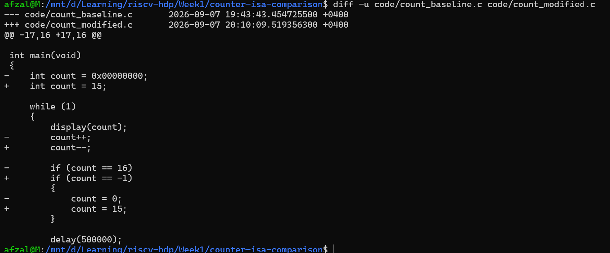
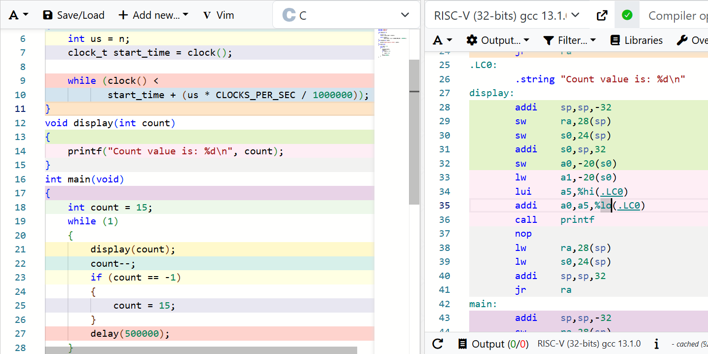
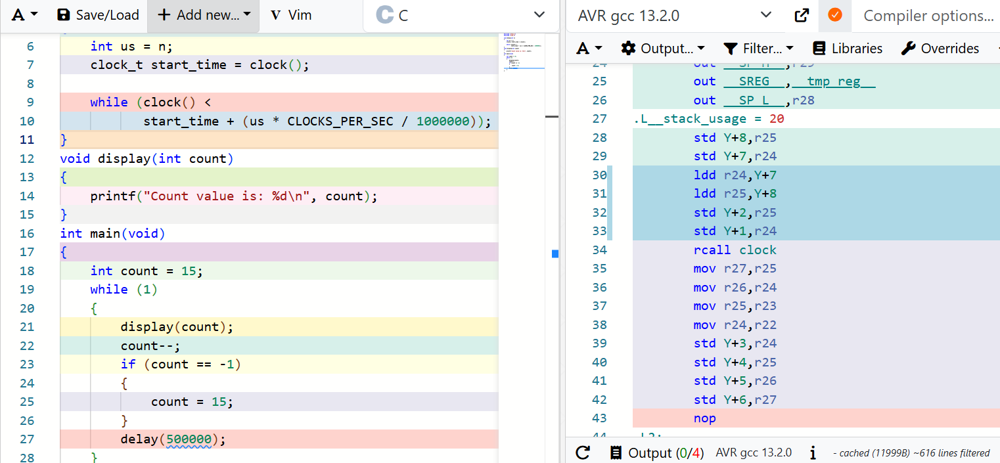
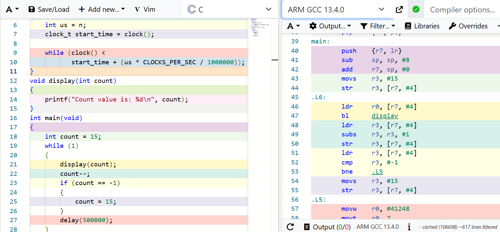
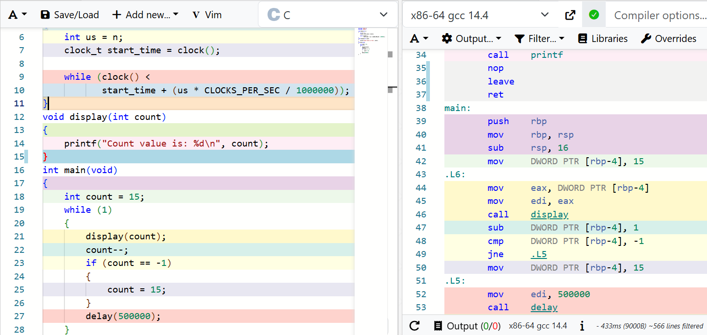

# Counter Compilation Across Different ISAs

## Aim

The aim of this experiment is to compile the same counter source
for RISC-V, AVR, ARM and x86-64 and compare the generated assembly.

The second experiment changes one part of the source and compares
the modified assembly with the baseline assembly.

## Experimental controls

- The source code is identical for every ISA.
- Compiler Explorer is used for every compilation.
- The compiler option is `-O`.
- Only the target compiler is changed in Experiment 1.
- Compiler names and versions are recorded.
- Only the assembly implementing `main()` is compared.

## Experiment 1: Baseline program

### Prediction

The same C source should produce the same counter behavior on every
target, but the instructions and register names should differ because
each compiler targets a different ISA. AVR may require additional
instructions because it operates mainly with 8-bit registers.

### RISC-V baseline observations

The counter is stored on the stack at `-20(s0)`.

- `sw zero,-20(s0)` initializes or resets the counter.
- `lw a0,-20(s0)` passes the counter to `display`.
- `addi a5,a5,1` increments the counter.
- `li a5,16` loads the comparison value.
- `bne a4,a5,.L5` skips the reset when the counter is not 16.
- `li a5,499712` followed by `addi a0,a5,288` constructs 500000.
- `call delay` calls the delay function.
- `j .L6` repeats the counter loop.

### Baseline source

The baseline source is stored in
[`code/count_baseline.c`](code/count_baseline.c).

### Compiler configuration

| Target | Compiler | Options |
|---|---|---|
| RISC-V 32-bit | RISC-V (32-bits) GCC 13.1.0 | None |
| AVR | AVR GCC 13.2.0 | None |
| ARM 32-bit | ARM GCC 13.4.0 | None |
| x86-64 | x86-64 GCC 14.4 | None |

### Baseline assembly comparison

| Operation | RISC-V 32-bit | AVR | ARM 32-bit | x86-64 |
|---|---|---|---|---|
| Counter location | `-20(s0)` | `Y+1:Y+2` | `[r7,#4]` | `[rbp-4]` |
| Initialization | `sw zero,-20(s0)` | Two `std` instructions | `movs` and `str` | `mov DWORD PTR,0` |
| Increment | `addi a5,a5,1` | `adiw r24,1` | `adds r3,r3,#1` | `add DWORD PTR,1` |
| Compare with 16 | `li` and `bne` | `cpi`, `cpc`, `brne` | `cmp` and `bne` | `cmp` and `jne` |
| Reset | `sw zero,-20(s0)` | Two `std` instructions | `movs` and `str` | `mov DWORD PTR,0` |
| Function call | `call` | `rcall` | `bl` | `call` |
| Loop back | `j` | `rjmp` | `b` | `jmp` |

### Baseline observations

All four compilers generated assembly that implements the same
counter sequence. The assembly instructions and register names differ
because each compiler targets a different ISA.

RISC-V uses load, store and `addi` instructions. ARM uses `ldr`, `str`
and `adds`. x86-64 can increment the counter directly in memory. AVR
uses two bytes for the counter and therefore loads, stores and compares
both parts of the value.

Successful compilation shows that each compiler can translate the
source for its target ISA. It does not measure execution speed or prove
operation on physical hardware.

### Screenshots

#### RISC-V


#### AVR


#### ARM


#### x86-64


## Experiment 2: Changing the Up-Counter to a Down-Counter

### Aim

The purpose of this experiment is to modify the original up-counter into a down-counter and observe how the generated assembly changes across RISC-V, AVR, ARM and x86-64.

### Source-code modification

The original counter displayed values from 0 to 15:

```c
int count = 0x00000000;

display(count);
count++;

if (count == 16)
{
    count = 0;
}
```

The modified counter displays values from 15 down to 0:

```c
int count = 15;

display(count);
count--;

if (count == -1)
{
    count = 15;
}
```

The complete modified source is available in [`code/count_modified.c`](code/count_modified.c).



### Prediction

The overall loop and function calls should remain similar because the structure of the program has not changed.

The addition operation should change to subtraction, the comparison constant should change from 16 to -1, and the reset value should change from 0 to 15.

The value -1 may appear directly in the assembly or as a value containing all one bits because signed integers are represented using two's complement.

### Compiler configuration

The same compilers and default compiler options used in Experiment 1 were retained.

| Target        | Compiler                    | Options |
| ------------- | --------------------------- | ------- |
| RISC-V 32-bit | RISC-V (32-bits) GCC 13.1.0 | None    |
| AVR           | AVR GCC 13.2.0              | None    |
| ARM 32-bit    | ARM GCC 13.4.0              | None    |
| x86-64        | x86-64 GCC 14.4             | None    |

### Results

| Operation        | RISC-V 32-bit        | AVR                                       | ARM 32-bit              | x86-64                               |
| ---------------- | -------------------- | ----------------------------------------- | ----------------------- | ------------------------------------ |
| Initialize to 15 | `li a5,15` and `sw`  | `ldi r24,15`, `ldi r25,0` and `std`       | `movs r3,#15` and `str` | `mov DWORD PTR [rbp-4],15`           |
| Decrement        | `addi a5,a5,-1`      | `sbiw r24,1`                              | `subs r3,r3,#1`         | `sub DWORD PTR [rbp-4],1`            |
| Compare with -1  | `li a5,-1` and `bne` | `cpi`, `cpc` and `brne`                   | `cmp r3,#-1` and `bne`  | `cmp DWORD PTR [rbp-4],-1` and `jne` |
| Reset to 15      | `li a5,15` and `sw`  | `ldi`, followed by two `std` instructions | `movs r3,#15` and `str` | `mov DWORD PTR [rbp-4],15`           |
| Call `display`   | `call display`       | `rcall display`                           | `bl display`            | `call display`                       |
| Call `delay`     | `call delay`         | `rcall delay`                             | `bl delay`              | `call delay`                         |
| Repeat loop      | `j .L6`              | `rjmp .L6`                                | `b .L6`                 | `jmp .L6`                            |

### RISC-V result

RISC-V changed the addition immediate from positive one to negative one:

```asm
addi a5,a5,-1
```

It loads -1 for the comparison and 15 for the reset:

```asm
li   a5,-1
bne  a4,a5,.L5
li   a5,15
sw   a5,-20(s0)
```



The extracted assembly is stored in [`assembly/modified_riscv32.s`](assembly/modified_riscv32.s).

### AVR result

AVR replaced the add-immediate-to-word instruction:

```asm
adiw r24,1
```

with the subtract-immediate-from-word instruction:

```asm
sbiw r24,1
```

Because an AVR `int` is represented using two bytes in this experiment, both bytes are compared with the two's-complement representation of -1.



The extracted assembly is stored in [`assembly/modified_avr.s`](assembly/modified_avr.s).

### ARM result

ARM replaced:

```asm
adds r3,r3,#1
```

with:

```asm
subs r3,r3,#1
```

The compiler uses `cmp r3,#-1` for the comparison and loads 15 when resetting the counter.



The extracted assembly is stored in [`assembly/modified_arm32.s`](assembly/modified_arm32.s).

### x86-64 result

x86-64 changed the direct memory addition into direct memory subtraction:

```asm
sub DWORD PTR [rbp-4],1
```

It compares the counter directly with -1:

```asm
cmp DWORD PTR [rbp-4],-1
jne .L5
```



The extracted assembly is stored in [`assembly/modified_x86_64.s`](assembly/modified_x86_64.s).

### Comparison with the baseline

The results matched the prediction:

* The initial value changed from 0 to 15.
* Increment instructions changed to decrement instructions.
* The comparison constant changed from 16 to -1.
* The reset value changed from 0 to 15.
* The `display`, `delay` and loop-back operations remained structurally similar.
* Each compiler used instructions belonging to its target ISA.

### Conclusion

Changing the C program from an up-counter to a down-counter produced corresponding changes in the assembly for all four targets.

Although the instruction names and register conventions differ, every compiler implemented the same intended behavior: initialize the counter to 15, decrement it after each display, detect -1 and reset the counter to 15.

This experiment compares compiler-generated assembly only. It does not determine processor speed because the programs were not benchmarked on physical processors.
