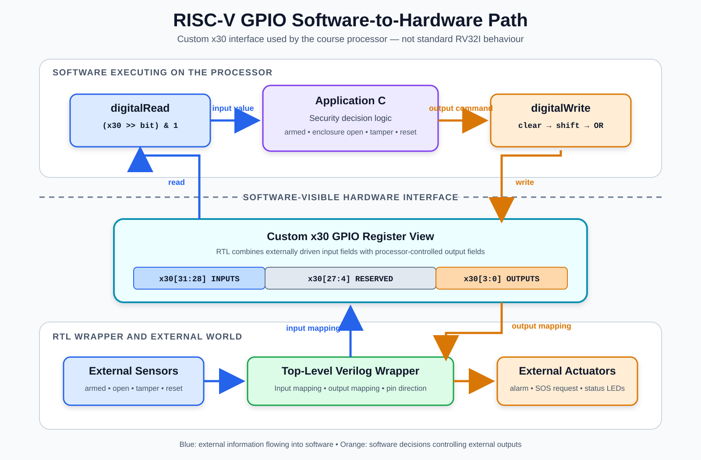

# Week 3 — Application-Specific RISC-V Cores and GPIO Architecture

## Overview

Week 3 examined how a RISC-V processor can communicate with external sensors and actuators. The main idea was to connect four levels of the system:

1. Application software
2. RISC-V instructions and registers
3. Verilog RTL
4. Physical GPIO signals

Example display-controller and sanitizer-dispenser projects were studied to understand this relationship. They were used as architectural references rather than copied as implementations.

No separate Week 3 experiment was identifiable from the supplied lecture material. This week is therefore documented as an architecture, code-understanding and project-planning stage. The practical C, assembly, RTL, simulation and synthesis work continues in Week 4.

## RV32I Integer Registers

An RV32I processor contains 32 integer registers named `x0` through `x31`. Each register is 32 bits wide.

Register `x0` is special because it is hardwired to zero. Values written to it are discarded, and every read returns zero.

The remaining registers hold values such as:

* Function arguments and return values
* Temporary calculations
* Saved values
* Return addresses
* Stack and frame pointers

Under the RISC-V ABI, `x30` is normally named `t5` and is a temporary general-purpose register.

Using `x30` as GPIO is therefore a custom hardware decision made in the course processor. Standard RV32I does not define `x30` as a GPIO register.

## Why Registers Cannot Store Every Variable

Registers are fast storage locations close to the processor datapath, but their number is limited. A processor cannot store every program variable permanently in its register file.

Values that cannot remain in registers may be stored in data memory. Local variables can be placed in a stack frame, while global data can occupy sections such as `.data` and `.bss`.

Week 4 examines this further by connecting C variables with compiler-generated assembly, stack allocation and memory accesses.

## Custom Use of x30 for GPIO

In the processor architecture studied during the course, the RTL is modified so that `x30` becomes a software-visible GPIO interface.

Individual bits or fields of `x30` can represent different signals:

* Some bits represent sensor or switch inputs.
* Some bits control LEDs, buzzers, motors or displays.
* Other bits may remain reserved.

Software can use normal RISC-V shift and logical instructions to read or update these fields.

The important point is that GPIO behaviour comes from the modified processor RTL. It does not come from the normal architectural meaning of `x30`.

## Software-to-Hardware GPIO Path



The diagram shows the two directions of communication.

The input path is:

1. An external sensor drives a physical input.
2. The top-level Verilog wrapper receives the signal.
3. RTL maps the signal into an input field of `x30`.
4. RISC-V instructions shift and mask the field.
5. Application C uses the resulting value.

The output path is:

1. Application C decides which output should change.
2. RISC-V instructions perform a masked write.
3. The output field of `x30` is updated.
4. The Verilog wrapper maps that field to an output port.
5. The output controls an actuator.

This makes `x30` the software-visible contract between the application and the custom GPIO hardware.

## Inputs, Outputs and Signal Ownership

A GPIO input is driven from outside the processor, for example by a button or sensor.

A GPIO output is driven by processor-controlled state and can control an LED, buzzer, motor or display.

If input and output fields share `x30`, the hardware must define ownership clearly:

* Input bits reflect external pins.
* Output bits retain values written by software.
* Reserved bits have defined behaviour.
* Updating one output must not corrupt another output.
* Software-written values must not override externally driven input fields.

The processor RTL and top-level wrapper must agree with the software about the position and direction of every bit.

An internal 32-bit Verilog bus is not equivalent to 32 physical input pins and 32 physical output pins. Internal buses and physical I/O pads are separate implementation concerns.

## Reading One GPIO Bit

A single GPIO bit can be extracted using a right shift followed by a mask:

```c
value = (gpio_register >> bit_position) & 1u;
```

The shift moves the selected bit into bit position zero. AND with `1` removes all remaining bits, guaranteeing that the result is zero or one.

Equivalent RISC-V assembly can use:

```asm
srli destination, source, bit_position
andi destination, destination, 1
```

For example, reading bit 31 requires shifting right by 31 positions and masking the result with one.

This forms the basis of a software `digitalRead` operation.

## Writing One GPIO Bit

Writing one output must preserve every unrelated field.

A general read-modify-write operation is:

```c
mask = 1u << bit_position;

gpio_register =
    (gpio_register & ~mask) |
    ((value & 1u) << bit_position);
```

This operation works in three stages:

1. `~mask` contains a zero at the destination bit.
2. AND clears only the destination while preserving the remaining bits.
3. The new value is restricted to one bit, shifted into position and inserted using OR.

This forms the basis of a software `digitalWrite` operation.

Assigning a completely new value to `x30` without masking could accidentally change other outputs. Safe masking is therefore part of the hardware/software interface.

## GPIO Packing and Physical Pin Cost

Packing multiple signals into one register gives software a compact interface. A single 32-bit value can represent many independent input, output and status fields.

This does not automatically reduce the number of physical chip pins.

A physical external signal normally requires:

* An I/O pad
* Input or output buffering
* ESD protection
* On-chip routing
* A package connection

Pin count can be reduced through multiplexing, serialization or bidirectional sharing. Merely placing signals in different bits of `x30` does not eliminate their physical connections.

The logical GPIO register and the physical chip interface must therefore be considered separately.

## Polling and Interrupts

Polling repeatedly checks an input:

```c
while (1) {
    input = digitalRead(INPUT_BIT);

    if (input) {
        digitalWrite(OUTPUT_BIT, 1);
    }
}
```

Polling is simple, but it continually executes instructions even when the input does not change. Its response latency depends on how frequently the program checks the input.

An interrupt-driven design allows the processor to perform other work until an event occurs. The event redirects execution to an interrupt service routine, after which normal execution can resume.

The example applications reviewed during these weeks primarily appear to use polling. Interrupts were discussed as an alternative, but a complete interrupt controller was not demonstrated in the supplied Week 3 material.

## Static and Dynamic Instructions

A static instruction is one instruction occurrence stored in the program.

A dynamic instruction is one execution of an instruction at runtime.

A program may contain a small number of static instructions but still execute billions of dynamic instructions. For example, ten instructions inside a loop produce one billion dynamic instruction executions when the loop repeats one hundred million times.

The processor reuses the same datapath over successive clock cycles. It does not need separate hardware for every execution of an instruction.

This connects to the Week 2 investigation, where a single static instruction inside a loop could execute many times.

## Application-Specific Instruction Selection

An application-specific RISC-V core can be designed around the instructions required by its intended application.

A possible process is:

1. Write the application in C.
2. Compile it for the selected RISC-V ISA.
3. Disassemble the generated program.
4. Identify the base instructions that were generated.
5. Ensure that the processor implements those instructions.
6. Remove optional hardware only when it is demonstrably unnecessary.

A smaller instruction subset may reduce implementation complexity, area or power. It also reduces the processor's flexibility.

The result is only as complete as the application and its test coverage. A control path that was not considered may require instructions missing from the identified subset.

## Verilog Modules and Wrappers

A GPIO-based processor system may contain:

* A processor core
* A register file
* GPIO-selection logic
* Instruction and data memories
* A UART loader
* A top-level wrapper
* A testbench

The wrapper connects the processor's internal GPIO representation to top-level input and output ports.

Changing the GPIO mapping may require corresponding changes in:

* Application masks and shifts
* Inline assembly
* Processor or register-file RTL
* Top-level wrapper ports
* Testbench stimulus
* Documentation

All these layers must agree on the bit allocation.

## FPGA LUTs and ASIC Logic

An FPGA contains configurable resources such as lookup tables, flip-flops, block memories and programmable routing.

A lookup table implements a Boolean function. FPGA synthesis maps Verilog combinational logic into LUTs and sequential state into flip-flops or other FPGA resources.

In an ASIC flow, synthesis maps the same RTL into gates, multiplexers, flip-flops and other standard cells from a technology library.

Therefore:

* FPGA implementation uses configurable LUT-based resources.
* ASIC implementation uses fixed manufactured cells and memory macros.
* RTL describes the required behaviour.
* The synthesis target determines its physical implementation.

## Proposed Project: Latched Enclosure Tamper and SOS Controller

The proposed original project is a **RISC-V-Based Latched Enclosure Tamper and SOS Controller**.

The controller will monitor a generic protected enclosure using GPIO inputs. It could be applied to an equipment box, storage cabinet, laboratory instrument or restricted electronics enclosure.

When armed, opening the enclosure or asserting a tamper signal will activate a local alarm and an alert indicator.

The alert will be latched. It will remain active even if the original sensor condition disappears. An explicit alarm-reset input will be required. Reset will only be accepted when the enclosure is closed and the tamper input is inactive.

The processor will also generate an `sos_request` GPIO output. This can notify an external communication module that an SOS should be transmitted.

The initial project will verify the SOS request signal. It will not claim that a real message was transmitted unless a communication module is separately implemented and tested.

### Proposed behaviour

1. A disarmed system does not treat an open enclosure as an intrusion.
2. Opening an armed enclosure activates the alert.
3. Tamper detection activates the alert with the highest priority.
4. The alert remains active after the triggering input disappears.
5. Alarm reset is rejected while the enclosure remains open or tamper remains active.
6. A valid reset clears the alert and returns the system to its disarmed state.
7. The system must be explicitly armed again after an alert.

### Provisional x30 allocation

|  Bit | Direction | Proposed purpose |
| ---: | --------- | ---------------- |
|   31 | Input     | System armed     |
|   30 | Input     | Enclosure open   |
|   29 | Input     | Tamper detected  |
|   28 | Input     | Alarm reset      |
| 27:4 | Reserved  | Future expansion |
|    3 | Output    | SOS request      |
|    2 | Output    | Local alarm      |
|    1 | Output    | Alert LED        |
|    0 | Output    | Armed LED        |

The processor hardware reset and the alarm-reset input are separate concepts.

The hardware reset initializes the complete processor system. The alarm-reset GPIO acknowledges a security event without rebooting the processor.

The project demonstrates:

* Input and output GPIO
* Safe bit masking
* Persistent state
* Priority between external events
* C control flow
* C-to-assembly analysis
* Application-specific instruction selection
* Verilog integration
* RTL simulation
* Synthesis
* Gate-level simulation

It applies the techniques learned from the reference applications without reproducing their application behaviour.

## Relationship to Week 4

Week 3 establishes the architecture and hardware/software interface.

Week 4 continues with:

* C variables and stack allocation
* RISC-V ABI conventions
* Inline assembly
* Branches and function calls
* Unique instruction identification
* Instruction-memory loading
* UART loading and bypass
* GPIO configuration in Verilog
* RTL simulation and VCD waveforms
* Synthesis
* SRAM black boxes
* Gate-level netlists
* Gate-level simulation

The proposed enclosure controller will later apply these techniques as an original implementation.

## Confirmed and Reconstructed Context

| Classification                            | Understanding                                                                                                                                                     |
| ----------------------------------------- | ----------------------------------------------------------------------------------------------------------------------------------------------------------------- |
| Confirmed from the reviewed material      | RV32I contains 32 integer registers, `x30` is used as custom GPIO, fields are accessed using shifts and masks, and Verilog connects processor state to GPIO ports |
| Confirmed from the application examples   | Input, display, sensor and actuator signals can be assigned to different `x30` fields                                                                             |
| Reconstructed from the lecture discussion | The comparison between polling and interrupts, physical GPIO cost and the motivation for an application-specific instruction subset                               |
| Not demonstrated during Week 3            | An original RTL experiment, synthesized design or working interrupt controller                                                                                    |
| Original project decision                 | The proposed latched enclosure tamper and SOS controller                                                                                                          |

## Scope and Evidence Boundary

Week 3 documents architectural understanding and project preparation.

It does not demonstrate:

* Execution on a custom Verilog processor
* A completed GPIO RTL implementation
* A working interrupt controller
* RTL simulation results
* Synthesis results
* Timing closure
* FPGA programming
* ASIC physical implementation
* Transmission of a real SOS message

These claims require implementation and evidence during later stages.

## References

The following repositories were studied as architectural references. Their application implementations were not copied into this repository.

* [RISC-V Display Controller](https://github.com/bhargav-vlsi/RISCV-Display-controller)
* [RISC-V-Based Automatic Sanitizer Dispenser](https://github.com/KanishR1/RISCV-based-Automatic-Sanitizer-Dispenser)
