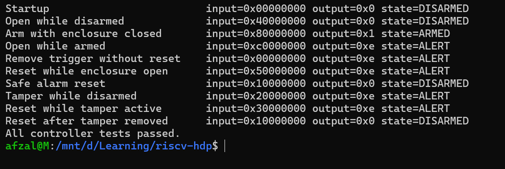
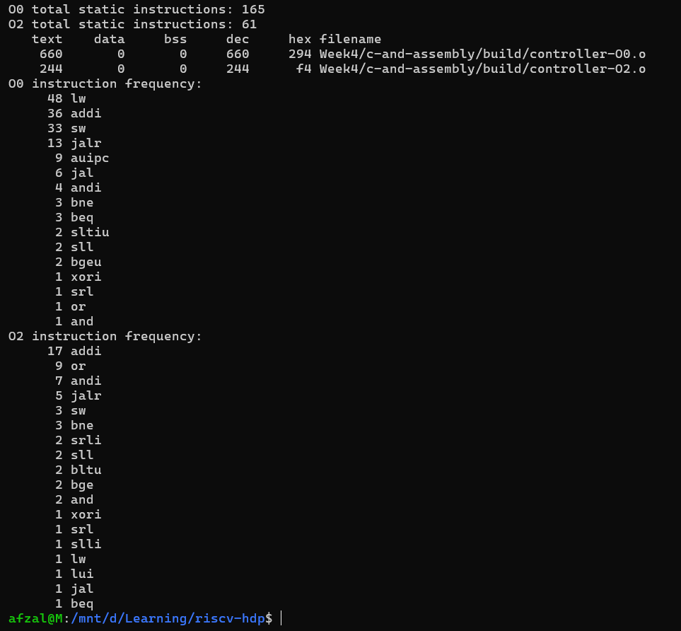
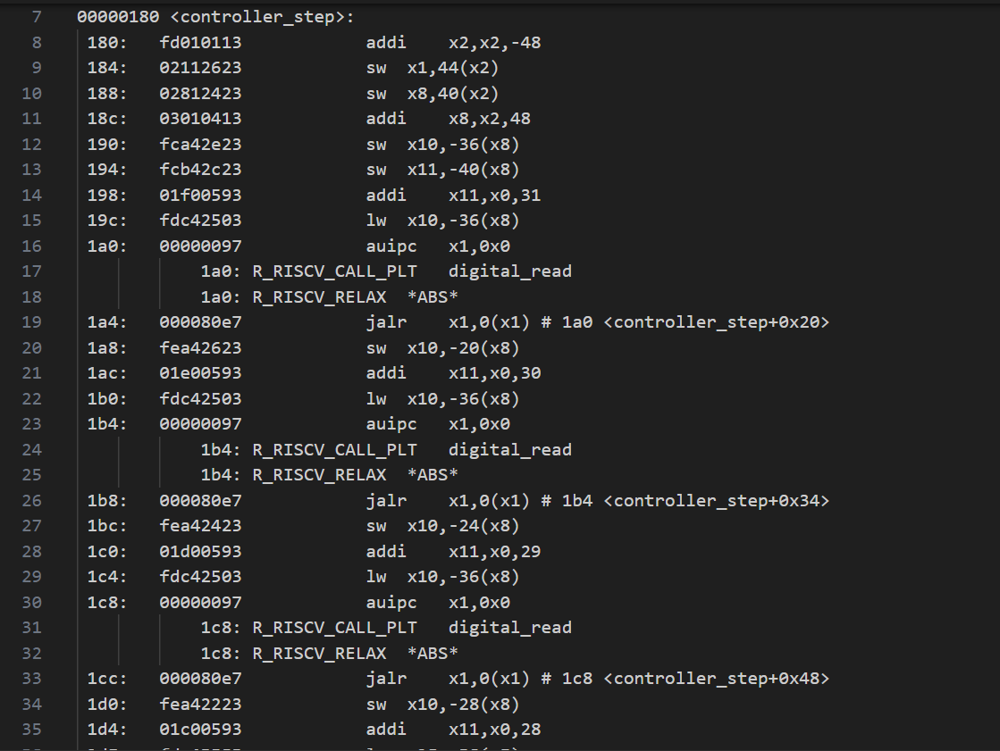
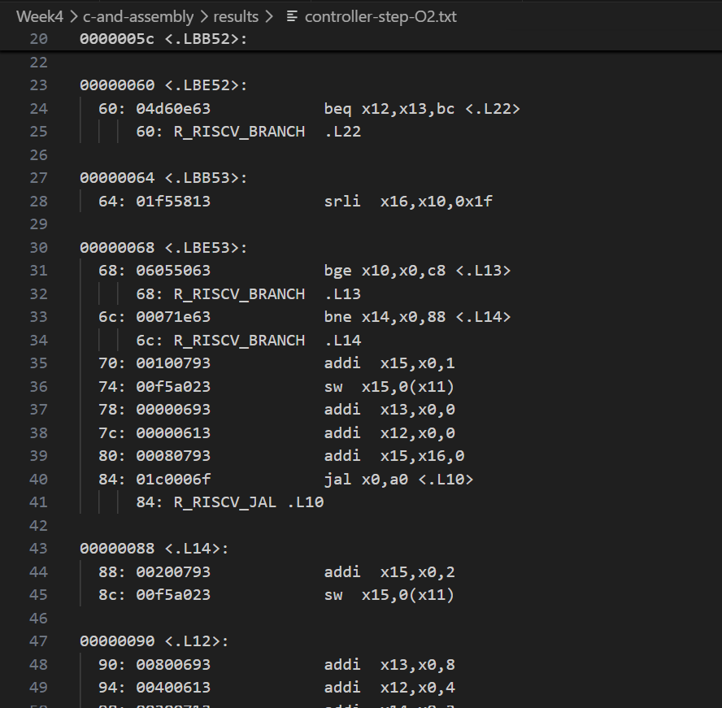
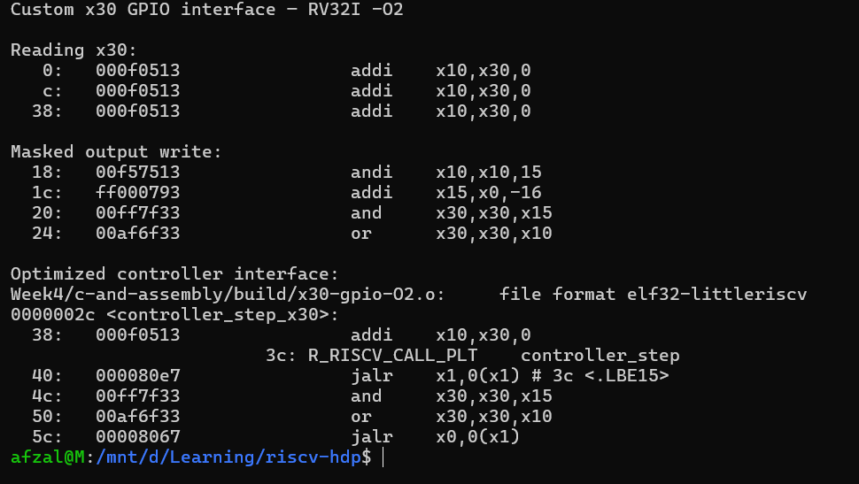
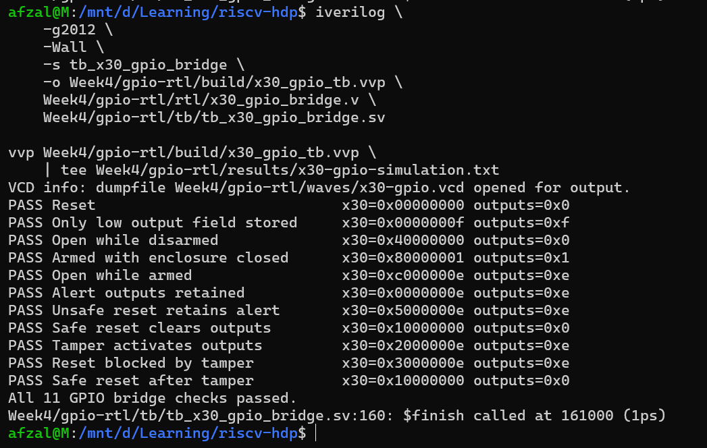
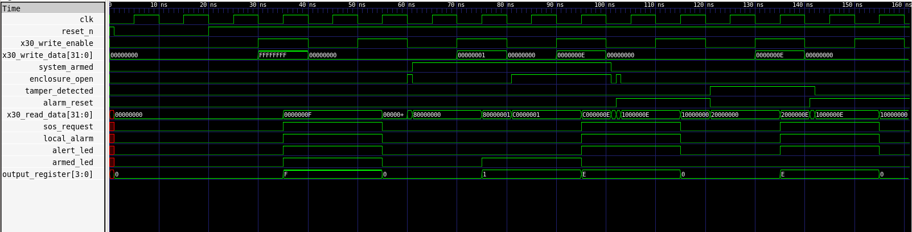
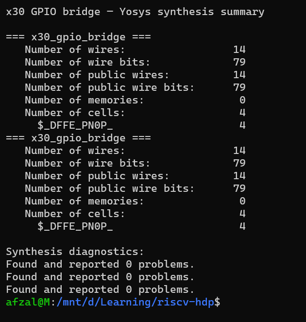
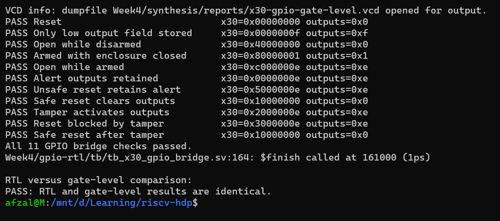
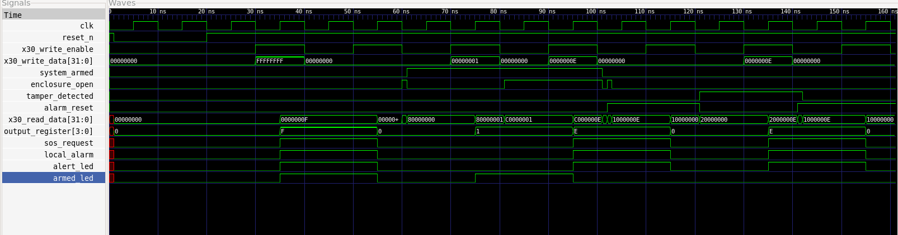

# Week 4 — C, Assembly, GPIO Configuration, Synthesis and Gate-Level Simulation

## Overview

Week 4 followed the path from application software to a synthesized hardware implementation.

The lecture connected:

1. C variables and control flow
2. Compiler-generated RISC-V assembly
3. Application-specific instruction selection
4. Program-memory loading
5. GPIO configuration in Verilog
6. RTL functional simulation
7. Logic synthesis
8. Gate-level simulation

The example doorbell, rain-alert and other GPIO projects were studied to understand this process. The experiments in this repository apply the same engineering ideas to an original latched enclosure tamper and SOS controller rather than reproducing those applications.

## Planned Experiments

### Experiment 1 — C and Assembly Analysis

An executable C model will represent GPIO using a normal 32-bit variable. This allows the enclosure-control behaviour, masking operations and state transitions to be tested before introducing custom processor hardware.

The program will then be compiled for RV32I and disassembled at different optimization levels.

The disassembly will be used to study:

- Stack-frame allocation
- Local-variable storage
- Initialization using `x0`
- Function arguments and return values
- Conditional branches
- Function calls
- Register use
- Static instruction selection

### Experiment 2 — Custom x30 GPIO Interface

A hardware-oriented version will use RISC-V inline assembly to read and write selected fields of `x30`.

This version will demonstrate:

- Inline-assembly operands
- Input and output constraints
- Clobber declarations
- GPIO bit extraction
- Masked GPIO updates

The standard Spike simulator treats `x30` as an ordinary register. It does not reproduce the course processor's custom GPIO behaviour. The custom interface must therefore be verified using the modified RTL processor or an appropriate RTL model.

### Experiment 3 — GPIO RTL Simulation

Verilog RTL will implement the proposed GPIO mapping for the enclosure controller.

A testbench will exercise conditions including:

- Reset
- Disarmed enclosure opening
- System arming
- Enclosure opening while armed
- Tamper detection
- Persistence of the latched alert
- Rejected reset while a sensor remains unsafe
- Successful reset after all sensors become safe

Icarus Verilog will compile the design, `vvp` will execute the simulation, and GTKWave will display the generated VCD waveform.

### Experiment 4 — Synthesis and Gate-Level Simulation

Yosys will synthesize the GPIO-related RTL and generate a gate-level netlist.

The synthesis report will be used to inspect:

- Inferred registers
- Combinational logic
- Cell counts
- Optimization
- Warnings
- Black-box modules

The synthesized netlist will then be simulated using the original testbench or a gate-level version of it.

## Experiment 1 Results — C and Assembly Analysis

### Purpose

The first experiment implemented the enclosure controller as ordinary C before connecting it to custom processor RTL.

A normal 32-bit variable represented the future `x30` GPIO value. This allowed the masking, state transitions and alert-latching behaviour to be tested independently of the processor implementation.

The experiment used three source files:

| File | Purpose |
|---|---|
| `controller.h` | GPIO allocation, controller states and declarations |
| `controller.c` | Digital input, digital output and state-transition logic |
| `host_test.c` | Host-side functional test cases and diagnostic output |

Separating the test harness from the controller keeps `printf` and `assert` out of the embedded control logic.

### Running the host test

The native executable can be rebuilt and executed using:

```bash
gcc \
    -std=c11 \
    -Wall -Wextra -Wpedantic \
    -O0 -g \
    c-and-assembly/src/controller.c \
    c-and-assembly/src/host_test.c \
    -o c-and-assembly/build/host_test

c-and-assembly/build/host_test
```

The test covered:

- Startup in the disarmed state
- Opening the enclosure while disarmed
- Arming with the enclosure closed
- Opening the enclosure while armed
- Removal of the original trigger without reset
- Reset while the enclosure remains open
- Safe alarm reset
- Tamper detection while disarmed
- Reset while tamper remains active
- Reset after tamper is removed

All selected test cases passed.

The test also checked that processor-controlled output updates preserved the externally supplied input fields.

### Functional results

| Test condition | Input word | Output field | Resulting state |
|---|---:|---:|---|
| Startup | `0x00000000` | `0x0` | `DISARMED` |
| Open while disarmed | `0x40000000` | `0x0` | `DISARMED` |
| Arm with enclosure closed | `0x80000000` | `0x1` | `ARMED` |
| Open while armed | `0xC0000000` | `0xE` | `ALERT` |
| Remove trigger without reset | `0x00000000` | `0xE` | `ALERT` |
| Reset while enclosure open | `0x50000000` | `0xE` | `ALERT` |
| Safe alarm reset | `0x10000000` | `0x0` | `DISARMED` |
| Tamper while disarmed | `0x20000000` | `0xE` | `ALERT` |
| Reset while tamper active | `0x30000000` | `0xE` | `ALERT` |
| Reset after tamper removed | `0x10000000` | `0x0` | `DISARMED` |

The alert output value is `0xE`, or binary `1110`. This asserts:

- Bit 3: SOS request
- Bit 2: local alarm
- Bit 1: alert LED

Bit 0, the armed LED, is cleared during the alert state.

The alert remained active after the triggering input disappeared. This demonstrates the intended latched behaviour.

Reset was rejected while the enclosure remained open or tamper remained active. A safe reset returned the controller to `DISARMED`.

### RV32I compilation

The reusable controller logic was compiled separately from the host test:

```bash
riscv64-unknown-elf-gcc \
    -march=rv32i \
    -mabi=ilp32 \
    -std=c11 \
    -Wall -Wextra -Wpedantic \
    -ffreestanding \
    -O0 -g \
    -c c-and-assembly/src/controller.c \
    -o c-and-assembly/build/controller-O0.o

riscv64-unknown-elf-gcc \
    -march=rv32i \
    -mabi=ilp32 \
    -std=c11 \
    -Wall -Wextra -Wpedantic \
    -ffreestanding \
    -O2 -g \
    -c c-and-assembly/src/controller.c \
    -o c-and-assembly/build/controller-O2.o
```

The generated objects were disassembled with instruction aliases disabled so that the underlying RV32I instructions remained visible.

### Optimization comparison

| Measurement | `-O0` | `-O2` | Change |
|---|---:|---:|---:|
| Static instructions | 165 | 61 | 63.0% reduction |
| `.text` size | 660 bytes | 244 bytes | 63.0% reduction |
| `lw` instructions | 48 | 1 | 47 fewer |
| `sw` instructions | 33 | 3 | 30 fewer |
| `addi` instructions | 36 | 17 | 19 fewer |
| Unique mnemonics | 16 | 18 | 2 more |

Because the selected ISA is RV32I without the compressed extension, each generated instruction occupies four bytes:

- `165 × 4 = 660` bytes
- `61 × 4 = 244` bytes

This explains why the static-instruction and `.text`-size reductions are identical.

Optimization reduced the number of instruction occurrences while slightly increasing the number of different instruction types. A smaller executable does not necessarily require fewer types of hardware operations.

### Stack-frame behaviour at O0

The unoptimized `controller_step` begins with:

```asm
addi x2,x2,-48
sw   x1,44(x2)
sw   x8,40(x2)
addi x8,x2,48
```

Register `x2` is the stack pointer. Subtracting 48 reserves a 48-byte stack frame.

Register `x1`, the return address, is saved because the unoptimized function calls helper functions. Register `x8`, used as the frame pointer, is also preserved.

Function arguments and intermediate values are repeatedly stored to and loaded from stack locations. This accounts for the high number of `lw` and `sw` instructions at `-O0`.

Before returning, the function restores the saved registers and releases the frame:

```asm
lw   x1,44(x2)
lw   x8,40(x2)
addi x2,x2,48
jalr x0,0(x1)
```

With aliases disabled, `jalr x0,0(x1)` is the underlying form of a return operation.

### Storing zero

The unoptimized and optimized forms both contain a store resembling:

```asm
sw x0,0(address_register)
```

This stores zero into the controller-state location.

It corresponds to assigning:

```c
*state = CONTROLLER_DISARMED;
```

because `CONTROLLER_DISARMED` has the numeric value zero. Register `x0` is permanently zero, so the compiler can store it directly without first loading zero into another register.

### Optimized control flow

At `-O2`, `controller_step` does not allocate a stack frame. No stack-pointer subtraction appears at its entry.

Most temporary values remain in registers, and the helper operations are incorporated into the optimized control flow. The separate `update_outputs` symbol present at `-O0` disappears at `-O2`, indicating that the compiler inlined its behaviour.

The optimized function still contains branches because the controller must distinguish between disarmed, armed, alert, tamper and reset conditions.

The reduction in stack traffic is the main reason that `lw` and `sw` occurrences fall substantially.

### Instruction-set observations

The complete `-O0` object used 16 different instruction mnemonics. The `-O2` object used 18.

Both builds used instructions from the base RV32I integer ISA. No multiplication or division instruction was generated, so this controller logic does not currently require the RISC-V `M` extension.

The precise instruction subset depends on:

- Compiler version
- Optimization level
- Source-code structure
- ABI
- Compilation flags

Therefore, an application-specific processor must be configured against the actual deployment build rather than assuming that every optimization level produces the same instruction set.

### Screenshot evidence

#### Host functional test



#### Optimization comparison



#### O0 stack-frame allocation



#### O2 optimized control flow



### Experiment 1 evidence boundary

The host test demonstrates the selected C-level behaviour.

The RV32I object compilation demonstrates that the controller can be translated for RV32I.

The disassembly demonstrates the emitted static instructions and compiler transformations.

This experiment does not yet demonstrate:

- Custom `x30` GPIO behaviour
- Execution on the Verilog processor
- RTL functionality
- Complete verification
- Hardware timing or performance
- FPGA operation
- Successful SOS transmission

## Experiment 2 Results — Custom x30 GPIO Interface

### Purpose

The second experiment investigated how application software can access the course processor's custom GPIO interface through RISC-V register `x30`.

In the standard RISC-V ABI, `x30` is the temporary register `t5`. It does not normally represent GPIO. The GPIO behaviour described here therefore depends on corresponding changes in the processor RTL and its top-level wrapper.

This experiment verifies that the C compiler and assembler can generate the intended `x30` instructions. It does not by itself reproduce the custom hardware behaviour.

### Interface Functions

The file `c-and-assembly/src/x30_gpio.c` implements four functions:

- `x30_read_snapshot()` copies the current value of `x30` into a compiler-managed C variable.
- `x30_digital_read()` reads one selected bit from that snapshot.
- `x30_write_outputs()` changes only the output field at `x30[3:0]`.
- `controller_step_x30()` connects the previously tested controller logic to the proposed `x30` interface.

The inline assembly explicitly declares `x30` as modified. A `memory` clobber is also used as a compiler-ordering barrier around the GPIO access.

### Compilation

The interface was compiled for the base RV32I instruction set at both `-O0` and `-O2`:

```bash
riscv64-unknown-elf-gcc \
    -march=rv32i \
    -mabi=ilp32 \
    -std=c11 \
    -Wall -Wextra -Wpedantic \
    -ffreestanding \
    -O0 -g \
    -c Week4/c-and-assembly/src/x30_gpio.c \
    -o Week4/c-and-assembly/build/x30-gpio-O0.o

riscv64-unknown-elf-gcc \
    -march=rv32i \
    -mabi=ilp32 \
    -std=c11 \
    -Wall -Wextra -Wpedantic \
    -ffreestanding \
    -O2 -g \
    -c Week4/c-and-assembly/src/x30_gpio.c \
    -o Week4/c-and-assembly/build/x30-gpio-O2.o
```

Both compilations completed without warnings or errors.

### Reading the GPIO Register

The optimized disassembly contains:

```text
addi x10,x30,0
```

This copies the current 32-bit value of `x30` into register `x10`, which is the normal function return-value register.

It is equivalent to taking a snapshot of the GPIO register. Individual inputs can then be extracted from the snapshot using shifts and masks.

### Masked GPIO Output Write

The optimized `x30_write_outputs()` function contains:

```text
andi x10,x10,15
addi x15,x0,-16
and  x30,x30,x15
or   x30,x30,x10
```

The sequence performs the following operations:

```c
output_bits &= 0x0000000f;
x30 &= 0xfffffff0;
x30 |= output_bits;
```

The first instruction prevents the supplied output value from affecting anything above bit 3.

The mask `0xfffffff0` clears the existing output field while retaining bits `31:4`. The OR instruction then inserts the new value into bits `3:0`.

This is a read-modify-write operation. It prevents an output update from accidentally replacing unrelated input or reserved fields.

### Effect of Optimization

At `-O0`, the compiler generated a 48-byte stack frame for `x30_write_outputs()` and stored intermediate C values in memory. It also emitted `addi x0,x0,0`, which acts as a no-operation.

At `-O2`, the function was reduced to the masking operations, the two `x30` modification instructions and the return instruction. The compiler also inlined the `x30` read and write operations into `controller_step_x30()`.

The optimized form is shorter, but both versions implement the same intended masking operation.

### Screenshot Evidence



### Result

This experiment confirms that:

- The toolchain accepts explicit use of RISC-V register `x30`.
- Software can take a snapshot of `x30`.
- GPIO output values can be restricted to bits `[3:0]`.
- An AND/OR sequence can preserve bits outside the output field.
- The compiler generates only RV32I instructions for this interface.
- Optimization can inline the interface and remove stack operations.

The experiment does not prove that physical GPIO pins respond to these instructions. That behaviour requires the matching custom processor RTL and must be checked through RTL simulation.

## Experiment 3 Results — x30 GPIO RTL Simulation

### Purpose

This experiment implemented and simulated the hardware boundary between the custom RISC-V `x30` register interface and the proposed external GPIO signals.

The earlier C experiment verified the enclosure-control policy. The inline-assembly experiment verified that the compiler could generate explicit accesses to `x30`. This experiment verifies how input and output fields are represented at the RTL boundary.

The module is intentionally a GPIO bridge rather than a complete RISC-V processor. It models the interface that would be connected to the processor register file or write-back path in a complete implementation.

### RTL GPIO Mapping

The `x30_gpio_bridge` module implements the following mapping:

| `x30` field | Ownership | RTL behaviour |
|---|---|---|
| Bit 31 | External input | Reflects `system_armed` |
| Bit 30 | External input | Reflects `enclosure_open` |
| Bit 29 | External input | Reflects `tamper_detected` |
| Bit 28 | External input | Reflects `alarm_reset` |
| Bits 27:4 | Reserved | Read as zero |
| Bit 3 | Processor output | Drives `sos_request` |
| Bit 2 | Processor output | Drives `local_alarm` |
| Bit 1 | Processor output | Drives `alert_led` |
| Bit 0 | Processor output | Drives `armed_led` |

The external input bits are not stored in the output register. They are sampled directly from the input ports whenever `x30_read_data` is read.

The four output bits are stored in a clocked register. They change only when `x30_write_enable` is asserted and are cleared by the active-low reset.

Although `x30_write_data` is 32 bits wide, the RTL stores only `x30_write_data[3:0]`. Therefore, a processor write cannot replace the externally owned input field.

### Software and Hardware Responsibilities

The software controller is responsible for decisions such as:

- Whether the enclosure condition should activate an alert
- Whether the alert should remain latched
- Whether a reset request is safe
- Which output value should be written

The RTL bridge is responsible for:

- Presenting external inputs through `x30[31:28]`
- Retaining the output field in `x30[3:0]`
- Connecting output bits to the corresponding GPIO ports
- Preventing a processor write from taking ownership of input bits

For example, the testbench labels one condition as an unsafe reset retaining the alert. The bridge does not independently decide that the reset is unsafe. Instead, the software-side test sequence does not issue a clearing write, so the output register retains its previous value.

### Simulation Procedure

The RTL and SystemVerilog testbench were compiled and executed with:

```bash
iverilog \
    -g2012 \
    -Wall \
    -s tb_x30_gpio_bridge \
    -o Week4/gpio-rtl/build/x30_gpio_tb.vvp \
    Week4/gpio-rtl/rtl/x30_gpio_bridge.v \
    Week4/gpio-rtl/tb/tb_x30_gpio_bridge.sv

vvp Week4/gpio-rtl/build/x30_gpio_tb.vvp \
    | tee Week4/gpio-rtl/results/x30-gpio-simulation.txt
```

An explicit `` `timescale 1ns/1ps `` declaration was included in both the RTL and testbench so that their simulation time units and precision are consistent.

### Self-Checking Testbench

The testbench performed 11 checks covering:

1. Reset clearing the output register
2. Ignoring the upper 28 bits of processor write data
3. Reading the enclosure-open input while disarmed
4. Driving the armed indicator
5. Driving the alert outputs
6. Retaining outputs without another write
7. Retaining the alert during an unsafe-reset test sequence
8. Clearing outputs after a safe-reset test sequence
9. Activating outputs for the tamper sequence
10. Retaining outputs while tamper remains active
11. Clearing outputs after tamper is removed

Each test compared the complete `x30_read_data` value and the four physical output signals against their expected values. Any mismatch would terminate the simulation using `$fatal`.

All 11 checks passed.

### Simulation Output



### Waveform Inspection

The testbench generated `gpio-rtl/waves/x30-gpio.vcd`. GTKWave was used to inspect:

- Clock and reset
- Processor write enable and write data
- Four external input signals
- Complete `x30_read_data`
- Internal four-bit output register
- SOS, alarm and LED outputs



The waveform confirms that:

- External inputs immediately appear in `x30[31:28]`.
- A processor write changes the output register on a rising clock edge.
- Only `x30_write_data[3:0]` are stored.
- Output values persist while write enable is low.
- Reset clears all four outputs.
- Input changes do not overwrite the stored output field.

### Result and Limitations

The simulation demonstrates correct logical behaviour for the applied test vectors and confirms separation between externally owned input bits and processor-owned output bits.

It does not yet demonstrate:

- Integration with a complete RISC-V register file
- Execution of the compiled C program by the RTL processor
- Physical FPGA or ASIC GPIO behaviour
- Electrical pin characteristics
- Transmission of an actual SOS message

These require additional processor integration, implementation and hardware verification.

## Experiment 4 Results — Synthesis and Gate-Level Simulation

### Purpose

The final experiment converted the synthesizable GPIO RTL into a generic gate-level netlist and checked that the synthesized design retained the behaviour observed during RTL simulation.

This experiment represents two distinct verification stages:

1. **Synthesis** converts behavioural RTL into registers and logic cells.
2. **Gate-level simulation** executes the generated structural netlist using simulation models for those cells.

### Yosys Synthesis Flow

The GPIO bridge was synthesized with Yosys using:

```bash
yosys \
    -Q \
    -s Week4/synthesis/scripts/synth_x30_gpio.ys \
    | tee Week4/synthesis/reports/x30-gpio-synthesis.log
```

The synthesis script:

- Reads the Verilog RTL
- Selects `x30_gpio_bridge` as the top module
- Checks the module hierarchy
- Runs generic synthesis
- Checks the synthesized design
- Reports resource statistics
- Writes Verilog and JSON netlists

### Synthesis Result

Yosys reported:

| Property | Result |
|---|---:|
| Wires | 14 |
| Wire bits | 79 |
| Public wires | 14 |
| Public wire bits | 79 |
| Memories | 0 |
| Cells | 4 |
| `$_DFFE_PN0P_` cells | 4 |
| Reported problems | 0 |

The four `$_DFFE_PN0P_` cells implement the four bits of `output_register`.

For this generated cell type:

- The clock acts on the positive edge.
- Reset is active low.
- The reset value is zero.
- The enable input is active high.

This corresponds to the original RTL, where four output bits are updated on a rising clock edge when `x30_write_enable` is asserted and are cleared when `reset_n` is low.

No separate combinational cells were required. The input field, reserved zeros and stored output field are joined using direct wiring and concatenation.



### Generic Cells and Foundry Cells

The generated `$_DFFE_PN0P_` elements are internal Yosys generic cells. They are not cells from an ASIC foundry library.

In an ASIC flow, generic logic would subsequently be mapped to characterized standard cells supplied by a technology library. Those cells contain information needed for area, timing and power analysis.

Large instruction and data memories are commonly provided as memory macros rather than synthesized from individual flip-flops. During some synthesis stages, these macros may appear as black boxes whose external interfaces are known while their internal implementations are supplied separately.

This GPIO bridge contains only a four-bit output register, so Yosys correctly reported zero memories and no memory black boxes.

### Gate-Level Simulation

The generated structural Verilog netlist was simulated with Yosys’s `simcells.v` models:

```bash
iverilog \
    -g2012 \
    -Wall \
    -Wno-timescale \
    -DGATE_LEVEL \
    -s tb_x30_gpio_bridge \
    -o Week4/synthesis/build/x30_gpio_gls.vvp \
    /usr/share/yosys/simcells.v \
    Week4/synthesis/netlist/x30_gpio_bridge_netlist.v \
    Week4/gpio-rtl/tb/tb_x30_gpio_bridge.sv

vvp Week4/synthesis/build/x30_gpio_gls.vvp \
    | tee Week4/synthesis/reports/x30-gpio-gate-level-simulation.txt
```

The same self-checking testbench used for RTL simulation was reused for the synthesized netlist. The `GATE_LEVEL` definition changed the VCD output filename so that the RTL waveform was not overwritten.

All 11 checks passed during gate-level simulation.

The normalized RTL and gate-level results were compared with `diff`. The comparison returned exit status zero, showing that the recorded check results were identical.



### Gate-Level Waveform



The gate-level waveform confirms that the synthesized flip-flops:

- Reset to zero
- Capture `x30_write_data[3:0]` on a rising clock edge
- Update only when write enable is asserted
- Retain their values when write enable is low
- Drive the four GPIO outputs correctly

The input signals continue to appear in `x30_read_data[31:28]`, while reserved bits read as zero.

### Relationship to UART Bypassing

A complete processor system may use a UART and bootloader to transfer program instructions into instruction memory. Simulating the complete UART transfer can take many clock cycles and introduces additional modules that are unrelated to the GPIO logic being debugged.

Bypassing UART means loading the program memory directly or testing a lower-level module without simulating the serial transfer. This reduces simulation time and isolates the processor or peripheral under test.

This experiment performs an even narrower module-level test: it directly drives the GPIO bridge’s processor-side write interface. It therefore bypasses the UART, bootloader, instruction memory and processor execution path.

This verifies the GPIO bridge independently, but it does not prove that the complete processor can boot and execute the C application.

### Result and Limitations

The gate-level simulation demonstrates logical equivalence for the 11 applied test cases. It confirms that generic synthesis preserved the tested RTL behaviour.

This result does not establish:

- Mapping to a particular FPGA LUT architecture
- Mapping to an ASIC foundry library
- Physical pin assignment
- Placement and routing
- Maximum clock frequency
- Setup or hold timing
- Timing closure
- Power consumption
- Behaviour of a complete processor, memory and UART system

The netlist simulation is zero-delay functional gate-level simulation. A timing-aware simulation would require characterized cells and annotated delays such as SDF data.

## Evidence Boundary

Successful C execution will demonstrate the tested software behaviour.

Successful RISC-V compilation will demonstrate that the compiler generated code for the selected ISA.

Disassembly will identify static instructions but will not measure hardware speed.

Successful RTL simulation will demonstrate behaviour for the applied test vectors but will not prove complete verification.

Successful synthesis will demonstrate that the RTL can be converted into a netlist for the selected synthesis target.

Gate-level simulation will test post-synthesis logical behaviour. It will not establish timing closure unless a characterized timing model and delay annotation are used.

The project will not claim that an actual SOS message was transmitted. The initial implementation will generate and verify an `sos_request` GPIO output.

## Repository Structure

```text
Week4/
├── README.md
├── c-and-assembly/
│   ├── src/
│   ├── build/
│   └── results/
├── gpio-rtl/
│   ├── rtl/
│   ├── tb/
│   └── waves/
├── synthesis/
│   ├── scripts/
│   ├── reports/
│   └── netlist/
├── diagrams/
└── screenshots/

```

## References

The following repositories were studied as learning references. Their application implementations are not copied into this repository.

- [RISC-V HDP Doorbell Example](https://github.com/davidbroughsmyth/riscv-hdp/tree/main/ex4/doorbell)
- [Rain Alert System](https://github.com/mavi62/Rain_Alert_System)
- [RISC-V Project IIITB](https://github.com/Pruthvi-Parate/RISCV_Project_IIITB)
- [Week 4 GPIO Configuration Reference](https://github.com/denizpelen/riscv-hdp/tree/master/week_4_task_5)
